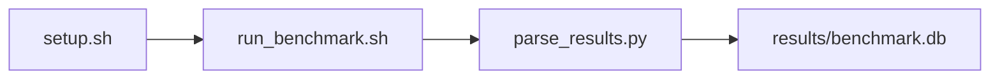

# JAX XLA Transformer Forward Pass Benchmark

[](LICENSE)
[](.github/workflows/ci.yml)

Target: Ubuntu 26.04 · AMD · see Hardware Requirements. This is a host benchmark, not a laptop `pip install` project.

## Quick Start

```bash
git clone https://github.com/garys-gpu-benchmarks/326-gpu-bench-amd-jax-xla-forwardpass-ubu2604.git
cd 326-gpu-bench-amd-jax-xla-forwardpass-ubu2604
sudo bash setup.sh --assume-yes
bash run_benchmark.sh --profile smoke --validate
```
Results are written to `results/benchmark.db` and `results/summary.json`.

This workload is executed on the validation host after the repository is copied there. `setup.sh` and `run_benchmark.sh` do not open an outbound SSH session.

Prerequisites: Ubuntu 26.04; AMD; Python 3.14.4; root or sudo for `setup.sh`. Framework: Bash, SQLite, Python, PyYAML, ROCm Runtime, JAX, XLA. This is a host benchmark, not a laptop `pip install` project.



## 1. Overview

Runs gpu-bench-jax-xla-forwardpass.py (the same script as 226/426): a small JAX/XLA transformer forward pass on synthetic tokens. dtype, sequence_len, hidden_size, num_layers, num_heads, batch_size, warmup_iters, num_iterations, seed, and vocab_size (32000, as 226/426) come from yaml. The collector runs two passes plus a summary row. output_format: csv Sweep dimensions: device_id, dtype, sequence_len, hidden_size, num_layers, num_heads, batch_size, warmup_iters.

## 2. What It Validates

- Validates JAX JIT compile time and forward-pass latency, throughput, and TFLOPS on the synthetic transformer
- #1: Forward-pass latency, ms (forward_latency_msec); is present and physically sensible.
- #2: Throughput, tokens/s (tokens_per_sec); is present and physically sensible.
- #3: Modeled TFLOPS, full forward pass (tflops); is present and physically sensible.
- #4: XLA compilation time, ms (jit_compile_msec); is present and physically sensible.
- #5: Peak HBM, GB (peak_hbm_gb) is present and physically sensible.

## 3. Metrics Captured

- **#1: Forward-pass latency, ms** — stored as `forward_latency_msec`.
- **#2: Throughput, tokens/s** — stored as `tokens_per_sec`.
- **#3: Modeled TFLOPS, full forward pass** — stored as `tflops`.
- **#4: XLA compilation time, ms** — stored as `jit_compile_msec`.
- **#5: Peak HBM, GB** — stored as `peak_hbm_gb`.

## 4. Hardware Requirements

### Supported environment

- OS: Ubuntu 26.04
- GPU vendor: AMD
- Framework family: Bash, SQLite, Python, PyYAML, ROCm Runtime, JAX, XLA
- Python: Python 3.14.4

### Reference validation environment

The tables below describe the machine used to generate the reference results. They are not a requirement that every user buy that exact cloud instance.

### System

Ubuntu 26.04 / AMD / Bash, SQLite, Python, PyYAML, ROCm Runtime, JAX, XLA

### GPU

Ubuntu 26.04 / AMD / Bash, SQLite, Python, PyYAML, ROCm Runtime, JAX, XLA

## 5. Software Requirements

| Component | Version |
|---|---|
| OS | Ubuntu 26.04 |
| Kernel | kernel 7.0.0 |
| Python | Python 3.14.4 |
| ROCm | ROCm 7.14 |
| rocBLAS | rocBLAS 5.2.0 |

Runs gpu-bench-jax-xla-forwardpass.py (the same script as 226/426): a small JAX/XLA transformer forward pass on synthetic tokens. dtype, sequence_len, hidden_size, num_layers, num_heads, batch_size, warmup_iters, num_iterations, seed, and vocab_size (32000, as 226/426) come from yaml. The collector runs two passes plus a summary row.

## 6. Installation

```bash
Run gpu-bench-jax-xla-forwardpass.py via collect_jax_xla.py
```

## 7. Running the Benchmark

```bash
Run gpu-bench-jax-xla-forwardpass.py via collect_jax_xla.py
```

**Validating results separately:**

```bash
export BENCHMARK_PYTHON=/usr/bin/python3.13  # optional
python3 -m venv .venv
source ".venv/bin/activate"
".venv/bin/python" scripts/validate_results.py
```

## 8. Output

### `results/benchmark.db` (SQLite)

raw_results.csv with pass1, pass2, and summary, plus the two JAX transcripts in raw_output.txt

check,dtype,sequence_len,hidden_size,tflops_method,requested_iterations,completed_iterations,status,forward_latency_msec,tokens_per_sec,tflops,jit_compile_msec,peak_hbm_gb
pass1,bfloat16,128,256,modeled_from_transformer_operation_count,8,8,ok,4.0,32000,0.5,900,2.0

```bash
Run gpu-bench-jax-xla-forwardpass.py via collect_jax_xla.py
```

### `results/summary.json`

Consolidated metrics from the most recent run — suitable for CI artifact upload or dashboard ingestion.

### `results/raw/<timestamp>.txt`

raw_results.csv with pass1, pass2, and summary, plus the two JAX transcripts in raw_output.txt

check,dtype,sequence_len,hidden_size,tflops_method,requested_iterations,completed_iterations,status,forward_latency_msec,tokens_per_sec,tflops,jit_compile_msec,peak_hbm_gb
pass1,bfloat16,128,256,modeled_from_transformer_operation_count,8,8,ok,4.0,32000,0.5,900,2.0

## 9. Baselines / Thresholds

Expected ranges and gates live in `config/benchmark_config.yaml` under `baselines:` or `thresholds:`. To update them, edit that file — never edit validation code directly.

## 10. Troubleshooting

**`setup.sh` missing collector**
Create cannot finish without `scripts/collect_workload.py`.

**`self_check` overlay rewritten**
Do not overwrite files listed in `results/overlay_lock.json`.

**Remote SSH drop during setup**
Reconnect and resume `bash setup.sh --assume-yes`. Do not wipe `.venv` or `.cache`.

## 11. NVIDIA H100 Coding Differences

Primary target is AMD ROCm. NVIDIA notes in this section are reference only and are not the execution path.

## Repository layout

```text
.
├── setup.sh
├── run_benchmark.sh
├── benchmark_specification.json
├── config/
├── scripts/
├── src/
├── tests/
├── docs/
├── results/
└── LICENSE
```
